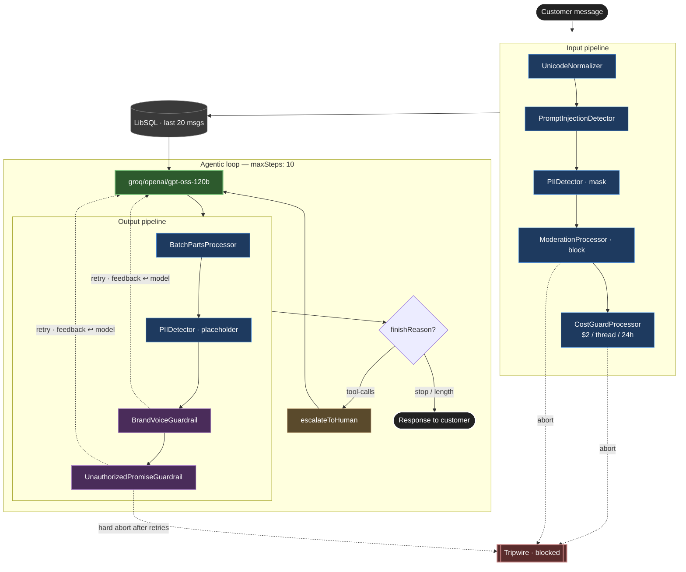

# Support Agent — Processor Architecture

How a customer message flows through `supportAgent` (`src/mastra/agents/support-agent.ts`): input pipeline → agentic loop → output pipeline, with the **tool loop** and **retry loop** highlighted.

## The two loops

**Tool loop** — `LLM → OutputPipeline → Decision (tool-calls) → escalateToHuman → LLM`. Pipelines run on every iteration.

**Retry loop** — `BrandVoiceGuardrail` and `UnauthorizedPromiseGuardrail` can call `abort(message, { retry: true })`, replaying the step with the correction appended to context. `retryCount` increments up to `maxProcessorRetries: 3`. Once exhausted, `UnauthorizedPromiseGuardrail` hard-aborts to Tripwire.

## Files

| Node | File |
| ---- | ---- |
| Agent | `src/mastra/agents/support-agent.ts` |
| BrandVoiceGuardrail | `src/mastra/processors/brand-voice-guardrail.ts` |
| UnauthorizedPromiseGuardrail | `src/mastra/processors/unauthorized-promise-guardrail.ts` |
| escalateToHuman | `src/mastra/tools/escalate-to-human.ts` |
